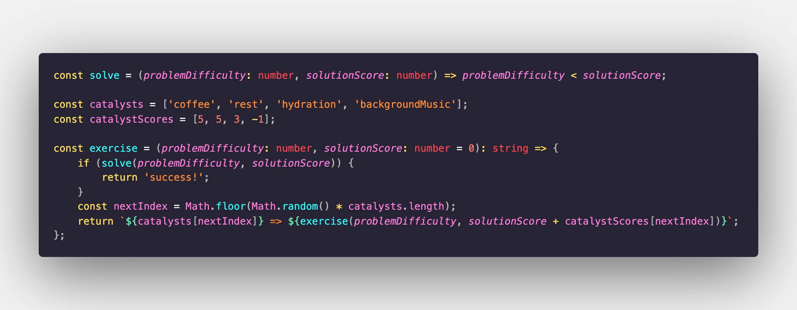

<h1 align="center">
  Leetcode
</h1>

  

Hello World! 👋

I just finished my M.Sc. and now I am stepping up my leetcode game! 🚀

run `npm run test` to trigger all exercise test cases.

And don't forget the formula of success: coffee => coffee => coffee => coffee => coffee => success!
